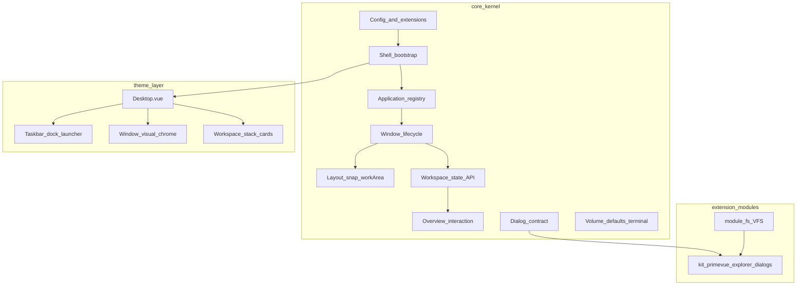

# Desktop kernel contract

Public surface of `@owdproject/core` for themes, apps, and modules. Internal implementation lives under `runtime/internal/` and is not part of this contract.

## Bootstrap order

1. Load `desktop.config.ts` (or legacy `owd.config.ts`) from the Nuxt root.
2. Validate config; warn only on keys that look like Nuxt options (`ssr`, `vite`, …).
3. Merge the **full** export into `runtimeConfig.public.desktop` (plus `coreVersion`). Same object is assigned to `appConfig.desktop`. Never spread onto `_nuxt.options`.
4. Install **Pinia**, then **theme → modules → apps** via `installDesktopPackage` (passes `desktop[configKey]` when a package declares `meta.configKey`).
5. Client plugin **`desktop-shell-init`** binds Pinia, sets up workspaces, loads default apps, and merges shell keys onto `appConfig.desktop` (before `<Desktop />` renders).
6. Client plugin **`desktop-register-desktop-apps`** flushes queued `defineDesktopApp` calls (`app:created`; legacy apps may still queue until flush).

## Desktop subsystems

Conceptual map of every desktop area **owned by core**. Use this when sculpting a theme: kernel provides state, contracts, and primitives; the theme renders chrome and wires DOM measurement. This section complements the API tables below — it does not replace them.

### Subsystem catalog

| # | Area | Kernel (core) | Theme / external modules | Key paths |
|---|------|---------------|--------------------------|-----------|
| 1 | **Bootstrap & shell init** | Pinia bind, workspace bootstrap, default-app load, shell key merge on `appConfig.desktop`. Plugins: `desktop-shell-init`, `desktop-register-desktop-apps`, `resize.client`. | Theme `Desktop.vue` mounts after `$desktopShellReady`. | `runtime/utils/initDesktopShell.ts`, `runtime/plugins/01.desktop-shell-init.client.ts`, `runtime/plugins/02.desktop-register-desktop-apps.client.ts` |
| 2 | **Desktop configuration** | `defineDesktopConfig`, merge into `runtimeConfig.public.desktop` / `appConfig.desktop`, `useDesktopConfig`, `useDesktopExtension`, runtime overrides via `useDesktopManager().setConfig()`, config validation/warnings. | Theme defaults via `defineDesktopTheme` + `defu`. | `kit/authoring.ts`, `runtime/composables/useDesktopManager.ts`, `runtime/composables/useDesktopConfig.ts` |
| 3 | **Package installation** | `defineDesktopTheme` / `defineDesktopModule`, `installDesktopPackage`, install order theme → modules → apps, per-package `configKey` namespace merge. | Each theme/app/module is its own Nuxt package. | `kit/authoring.ts` |
| 4 | **Shell readiness & options** | `useDesktopShellReady` (`$desktopShellReady` after init). `useDesktopShellOptions` reads `systemBar` flags (`enabled`, `position`, `startButton`) — **config only**, no UI. | Theme renders taskbar/start button from those flags. | `runtime/composables/useDesktopShellReady.ts`, `runtime/composables/useDesktopShellOptions.ts` |
| 5 | **Shell identity & session** | `useDesktopShellIdentity` (guest default, `userHome`, `setShellIdentity` for auth). `useDesktopSession` (`initiateShutdownToStart` → `/start`). | `/start`, `/boot` pages, shutdown/boot animations and styling. | `runtime/composables/useDesktopShellIdentity.ts`, `runtime/composables/useDesktopSession.ts` |
| 6 | **Application registry** | `defineDesktopApp`, `flushPendingDesktopApps`, `useApplicationManager` (launch, running apps, open windows), `useApplicationEntries` (sorted/filtered launcher list), per-app meta store. | Theme launcher/grid consumes `useApplicationEntries`. | `kit/defineDesktopApp.ts`, `runtime/composables/useApplicationManager.ts`, `runtime/composables/useApplicationEntries.ts`, `runtime/stores/storeApplicationMeta.ts` |
| 7 | **Window lifecycle** | Internal `WindowController` / `ApplicationController`: focus, z-index, minimize, `setWorkspace`. Global z-index counter and work-area rect in `useDesktopWindowStore`. Per-app window map in `storeApplicationWindows`. | Theme `Window*.vue` wraps kernel primitives; `provide/inject` for `windowController`. See **Window lifecycle** below. | `runtime/stores/storeDesktopWindow.ts`, `runtime/stores/storeApplicationWindows.ts` |
| 8 | **Layout, maximize, work area** | `useToggleWindowMaximize`, `utilWindowMaximizeLayout`, `utilWindowLayout` (snap rects, bounds restore), `useDesktopWorkArea` writes measured stage rect to store. | Theme measures shell stage DOM and calls `useDesktopWorkArea`. | `runtime/composables/useToggleWindowMaximize.ts`, `runtime/utils/utilWindowMaximizeLayout.ts`, `runtime/utils/utilWindowLayout.ts`, `runtime/composables/useDesktopWorkArea.ts` |
| 9 | **Drag, Aero snap, edge drop** | `useWindowDragHandlers`, `useWindowSnapDrop`, `utilDetectSnapZone`, `useWorkspaceEdgeDrop`, hint bases `DesktopWindowSnapHintsBase` / `DesktopWorkspaceEdgeHintsBase`. | Theme wires drag in `Window.vue`; styles snap/edge hints. | `runtime/composables/useWindowDragHandlers.ts`, `runtime/composables/useWindowSnapDrop.ts`, `runtime/utils/utilDetectSnapZone.ts`, `runtime/composables/useWorkspaceEdgeDrop.ts` |
| 10 | **Workspaces — state & API** | `useDesktopStore` (overview flag, z-index seed, default-apps map). `useDesktopWorkspaceStore`: `list`, `active`, `overview`, `createWorkspace`, `removeWorkspace`, `resolveWorkspaceFallback`. `utilWorkspaceWindows` / `countWindowsOnWorkspace`. | Theme reads workspace list for tray, indicators, overview entry. | `runtime/stores/storeDesktop.ts`, `runtime/stores/storeDesktopWorkspace.ts`, `runtime/utils/utilWorkspaceWindows.ts` |
| 11 | **Workspaces — interaction** | `useWorkspaceManager` (overview keyboard, HTML5 drop between desktops, `removeWorkspace` with window migration). `useWorkspaceOverviewLiveScale`, `useWorkspaceOverviewCapture`, `utilCaptureElementToCanvas`. | Theme overview UI (cards, wallpaper preview, remove button, scale shell). Workspace removal rules: see **Window lifecycle** below. | `runtime/composables/useWorkspaceManager.ts`, `runtime/composables/useWorkspaceOverviewLiveScale.ts`, `runtime/composables/useWorkspaceOverviewCapture.ts` |
| 12 | **Kernel Vue components** | `DesktopCore`, `DesktopApplicationRender`, `DesktopApplicationWindowsRender`, `DesktopWindow` / `DesktopWindowNav` / `DesktopWindowContent`, `DesktopBackground`, `DesktopTime`, snap/edge hint bases. | `Desktop.vue` wraps `DesktopCore`; theme chrome around window primitives. | `runtime/components/` (`prefix: 'Desktop'` in core `module.ts`; source files e.g. `window/Window.vue`) |
| 13 | **Dialogs** | Contract `desktopDialogProvider`, `useDesktopDialogs` (theme inject or browser fallback). Inject key: `runtime/constants/desktopShellKeys.ts`. | PV implementation: `@owdproject/kit-primevue` (`createDesktopDialogs`). | `runtime/dialogs/desktopDialogProvider.ts`, `runtime/composables/useDesktopDialogs.ts` |
| 14 | **Secondary shell services** | `useDesktopDefaultAppsStore` + `useDesktopManager` default-app routing. `useDesktopVolumeStore` (master volume). `useTerminalManager` (command registry; `app-terminal` registers commands). | Theme volume control, terminal UI, “open with” flows. | `runtime/stores/storeDesktopDefaultApps.ts`, `runtime/stores/storeDesktopVolume.ts`, `runtime/composables/useTerminalManager.ts` |
| 15 | **Global shell behaviour** | `useBlockNonInputContextMenu` (desktop-style context menu policy). `useDesktopStore` persistence when `@owdproject/module-persistence` is installed. Pinia ids: `desktop`, `desktop/workspace`, `desktop/window`, `desktop/volume`, `desktop/defaultApps`, `desktop/application/${appId}/windows`, `desktop/application/${appId}/meta`. Legacy `owd/*` keys are migrated once on client boot via `migratePersistedStoreIds`. | Theme chooses where to call context-menu blocking; boot/shutdown pages. | `runtime/composables/useBlockNonInputContextMenu.ts`, `runtime/stores/storeDesktop.ts`, `runtime/stores/storeIds.ts`, `runtime/utils/migratePersistedStoreIds.ts` |

### Out of core (by user-facing area)

| User-facing area | Not in core |
|------------------|-------------|
| Launcher / Start menu | Theme (e.g. `NovaLauncherOverlay`) — uses `useApplicationEntries` |
| Taskbar / Dock / System tray | Theme UI; core exposes `systemBar` / `dockBar` config keys only |
| Workspace overview cards, wallpaper preview, remove button | Theme layout/CSS; core provides state, scale/capture helpers, `removeWorkspace` API |
| Explorer file UI (`DesktopExplorer*`) | `@owdproject/kit-primevue` |
| VFS, paths, headless explorer APIs | `@owdproject/module-fs` |
| Window titlebar, chrome buttons, shadows | Theme wrappers around `DesktopWindow*` |

## Package layout

| Path | Role | Auto-imported in apps? |
|------|------|------------------------|
| `kit/` | Module-time authoring (`defineDesktop*`, `installDesktopPackage`, validation) | No — import `@owdproject/core/kit/*` or root barrel |
| `runtime/` | Client kernel (composables, stores, utils, components, plugins) | Composables, stores, utils only (via `addImportsDir`) |
| `runtime/internal/` | Window/application controllers | No |
| `runtime/constants/` | Shell layout bands, inject keys | No |

## Public API

### Configuration

| Export | Use |
|--------|-----|
| `defineDesktopConfig({ theme, apps, modules, ... })` | Root `desktop.config.ts` — `@owdproject/core/kit/authoring` |
| `defineDesktopModule` / `defineDesktopTheme` | Authoring extension modules and themes (`@owdproject/core/kit/*`); Tailwind v3 + `tailwindcss-primeui` live in `@owdproject/kit-primevue` — themes call `registerThemeTailwindPath` / `registerTailwindPath` from `@owdproject/kit-primevue/kit/registerTailwindPath` after `installModule('@owdproject/kit-primevue')` |
| `runtimeConfig.public.desktop` | Full merged config (manifest + shell + extension namespaces) |
| `useDesktopConfig()` | Reactive access to `public.desktop` |
| `useDesktopExtension(key)` | One extension namespace (`fs`, `terminal`, …) |
| `hasDesktopModule` / `hasDesktopApp` / `hasDesktopExtension` | Manifest and extension checks (`runtime/composables/useDesktopManifest.ts`) |
| `useDesktopManager().setConfig()` | Runtime shell overrides on `appConfig.desktop` |

Shell keys in core types: `name`, `defaultApps`, `features`, `systemBar`, `dockBar`, `workspaces`, `explorer`, `docs`. Extension keys (`fs`, `terminal`, …) are typed via **module augmentation** in each package (`types/desktop.d.ts`), not an allowlist in core.

### Applications

| Export | Use |
|--------|-----|
| `defineDesktopApp(config)` | App plugin (`app:created` recommended; legacy sync `setup` still queues until flush) |
| `useApplicationManager()` | Launch entries, list running apps, resolve open windows |

Apps register via Nuxt modules listed in `desktop.config.ts` → `apps`.

### Kernel Vue components (global)

Registered from `runtime/components` with `pathPrefix: false`:

| Component | Role |
|-----------|------|
| `DesktopCore` | Kernel shell wrapper (props, workspace init, default slot) |
| `DesktopApplicationRender` | Iterates running apps; delegates per-app window lists |
| `DesktopApplicationWindowsRender` | Renders one app's open windows (workspace filter, slot for theme `Window`) |
| `DesktopWindow` / `DesktopWindowNav` / `DesktopWindowContent` | Window chrome primitives |
| `DesktopBackground` / `DesktopTime` | Optional shell utilities |
| `DesktopWindowSnapHintsBase` / `DesktopWorkspaceEdgeHintsBase` | Unstyled snap and workspace-edge drop hints |

Themes expose **`Desktop.vue`** or **`Desktop.client.vue`** as the theme entry point (`app.vue` → `<Desktop />`). Prefer **`Desktop.client.vue`** when the theme uses Pinia in shell chrome so the whole tree stays client-only. Themes wrap `DesktopCore` and kernel window components with theme-specific chrome.

### Stores & composables (auto-imported)

| Symbol | Role |
|--------|------|
| `useDesktopStore` | Shell state (workspace overview flag, z-index counter, default-apps map); Pinia id `desktop`; persisted with `module-persistence` |
| `useDesktopWorkspaceStore` | Active workspace, overview mode, `createWorkspace` / `removeWorkspace`, `resolveWorkspaceFallback` |
| `useDesktopWindowStore` | Global z-index increment + measured work area (`workArea`, `setWorkArea`) |
| `useDesktopDefaultAppsStore` | Feature → default app/entry mapping (`getDefaultApp`, `setDefaultApp`) |
| `useDesktopVolumeStore` | Master volume level |
| `useWorkspaceManager` | Overview keyboard, HTML5 drop between workspaces, `removeWorkspace` (migrates windows) |
| `useApplicationManager` | Launch app entries, track running apps and open windows |
| `useApplicationEntries` | Sorted/filtered app entry list for launchers |
| `useDesktopDialogs` | Confirm/alert/prompt via theme inject or browser fallback |
| `useToggleWindowMaximize` | Maximize/restore; work-area-aware via `useDesktopWindowStore.workArea` |
| `useDesktopShellIdentity` | Shell user (`userId`, `displayName`, `avatarUrl`, `userHome`); Guest default; auth calls `setShellIdentity` |
| `useDesktopSession` | Shutdown flow (`shuttingDown`, `initiateShutdownToStart` → `/start`) |
| `useDesktopShellReady` | `true` after `desktop-shell-init` has bound Pinia and bootstrapped workspaces |
| `useDesktopShellOptions` | Reactive `systemBar` flags from `appConfig.desktop` |
| `useWindowSnapDrop` / `useWorkspaceEdgeDrop` | Aero snap zones and workspace edge drop while dragging windows |
| `useWindowDragHandlers` | Theme `Window.vue` drag wiring (snap + edge drop; work area from store) |
| `useWorkspaceOverviewLiveScale` / `useWorkspaceOverviewCapture` | Overview live fit and optional DOM snapshot capture |
| `useDesktopWorkArea` | Measure shell stage DOM rect → writes `useDesktopWindowStore.workArea` |
| `useTerminalManager` | Register and resolve shell terminal commands (used by `app-terminal`) |
| `useBlockNonInputContextMenu` | Block browser context menu on non-input elements (skipped in debug mode) |

Explorer headless APIs live in **`@owdproject/module-fs`**. PrimeVue explorer UI (`DesktopExplorer*`) is in `@owdproject/kit-primevue`.

### Window lifecycle (internal contract)

`WindowController` (internal) guarantees:

- `focus()` / `actions.bringToFront()` — exclusive focus + monotonic z-index via `useDesktopWindowStore`
- `minimize()` / `unminimize()` — toggles `state.active`
- `setWorkspace(id)` — assigns window to a workspace

**Removing a workspace:** `useWorkspaceManager.removeWorkspace(id)` requires at least three desktops (minimum two after removal). Open windows on the removed desktop are **migrated** (not closed) to `resolveWorkspaceFallback(id)` — the last workspace in `list` excluding the removed id. Windows without an explicit `workspace` belong to the active desktop for this purpose. If the active desktop is removed, `active` becomes the fallback target.

Contract tests: `packages/core/test/windowController.contract.test.ts`, `useWorkspaceManager.contract.test.ts`.

## Theme obligations

1. Provide `Desktop.vue` (theme entry) registered as a global component by the theme module.
2. Wrap kernel components; do not reimplement window manager logic in the theme.
3. Use `provide/inject` for `windowController` only inside theme `Window*.vue` wrappers.
4. Install `@owdproject/module-fs` when needed for VFS and headless explorer APIs. PV explorer UI: `@owdproject/kit-primevue`.
5. Prefer `defineDesktopTheme` so shell defaults merge with `defu(public.desktop, themeDefaults)`.

## Extension packages

Keep these packages **separate** — do not merge explorer UI kits into `module-fs` or core.

| Package | Layer |
|---------|--------|
| `@owdproject/core` | Kernel + shell composables/utils/components (flat `runtime/`) |
| `@owdproject/kit-primevue` | PrimeVue Nuxt module, `createDesktopDialogs`, PV explorer chrome |
| `@owdproject/module-fs` | ZenFS virtual filesystem + headless explorer (`defineDesktopModule`, `configKey: 'fs'`). Only package that imports `@zenfs/*`. |
| `@owdproject/module-persistence` | Pinia persistence (optional) |
| `@owdproject/app-terminal` | Terminal app (`configKey: 'terminal'`) |

Deprecated (empty modules only): `@owdproject/kit-theme`, `@owdproject/kit-fs`, `@owdproject/kit-explorer`. Do not import `@owdproject/kit-*/runtime/*` — use `@owdproject/core`, `@owdproject/module-fs`, or `@owdproject/kit-primevue` directly.

**Stacks** (see also `MIGRATION_3.4.md`):

| Stack | Needs `module-fs`? |
|-------|-------------------|
| Core + theme (windows, apps) | No |
| `kit-primevue` with `{ explorer: false }` (dialogs only) | No |
| `DesktopExplorer*` (default `kit-primevue`) | Yes — list in `desktop.config.ts` `modules` |

Themed file explorer: `module-fs` in `desktop.config.ts` → `@owdproject/kit-primevue` in theme → theme-specific explorer shell.

Dialog and maximize contracts live in core (`runtime/dialogs/desktopDialogProvider.ts`, `useDesktopDialogs`, `useToggleWindowMaximize`, `useDesktopWindowStore.workArea`). PV dialog **implementation**: `@owdproject/kit-primevue`.

## Migrating packages (3.3.2)

Themes, apps, and extension modules should adopt `defineDesktopTheme` / `defineDesktopModule`, module augmentation for `configKey`, and runtime composables. See **[MIGRATION_3.3.2.md](./MIGRATION_3.3.2.md)** and the full guide in `docs/content/6.setup/5.migrate-packages-3.3.2.md`.

## Package exports (semver-stable)

Supported deep imports from `@owdproject/core`:

- `@owdproject/core/kit/*` — authoring helpers (`defineDesktopConfig`, `defineDesktopModule`, …)
- `@owdproject/core/runtime/composables/*`
- `@owdproject/core/runtime/constants/*`
- `@owdproject/core/runtime/dialogs/*`
- `@owdproject/core/runtime/utils/*`
- `@owdproject/core/runtime/stores/*`
- `@owdproject/core/runtime/components/*`
- `@owdproject/core/runtime/types/*`

**Not supported:** `@owdproject/core/runtime/internal/*` (controllers and other implementation details). Importing internal paths is not part of the public contract and may break without a major release.

## Versioning

Breaking changes to this contract require a semver major (or minor with explicit `BREAKING CHANGE` in changelog) and coordinated theme updates in separate repos.
